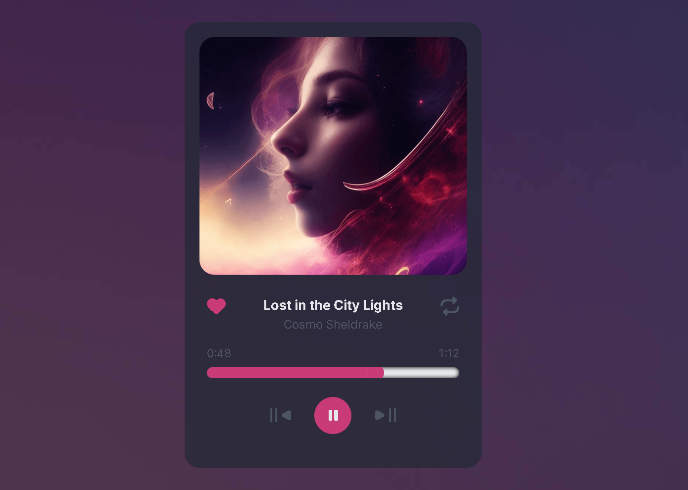

# Music player

La idea de este proyecto fue brindada por [devChallenges](https://devchallenges.io/challenges), es una página web que permite reproducir música, agregar canciones a favoritos y reproducir en bucle.

## Vista previa



## Funcionalidades

_Reproducir música:_ En la página web se podrá escuchar la canción que tenga el enfoque en ese momento, se podrá cambiar las canciones con los botones de siguiente y anterior.

_Canciones favoritas:_ Se podrá agregar diferentes canciones a favoritas y de esta manera destacar sobre las demás canciones.

_Reproducción en bucle:_ Se podrá reproducir la canción en bucle, de esta manera se podrá escuchar la canción las veces que se desee.

## Comenzando 

1. Clona este repositorio en tu máquina local o descargar la carpeta comprimida del proyecto:

   ```bash
   git clone https://github.com/drifterDev/music-player.git
   ```

### Prerrequisitos 

Antes de comenzar, asegúrate de tener instalado `npm` en tu sistema. Si no lo tienes instalado, puedes descargarlo e instalarlo desde [el sitio web oficial de Node.js](https://nodejs.org/).

### Instalación 

1. Descargar las dependencias necesarias del proyecto:

   ```bash
   npm install
   ```

2. Correr el comando para construir el proyecto:

   ```bash
   npm run build
   ```

3. Levantar un servidor local para previsualizar el proyecto:

   ```bash
   npm run preview
   ```

## Construido con 

* [Vite](https://vitejs.dev/) - Bundler
* [CSS](https://developer.mozilla.org/es/docs/Web/CSS) - Lenguaje de estilos
* [JavaScript](https://developer.mozilla.org/es/docs/Web/JavaScript) - Lenguaje de programación usado

## Contribuyendo 

Aprecio cualquier sugerencia para mejorar el contenido de este proyecto. Si deseas contribuir, por favor crea un "issue" en el repositorio o contáctame directamente. Valoraré tus aportes para mejorar este repositorio.

## Licencia 

Los códigos incluidos en este proyecto están bajo la Licencia MIT. Para obtener más información, consulta el archivo [LICENSE](LICENSE) en la raíz del repositorio.

## Créditos a Fifty sounds

Las canciones utilizadas en este proyecto han sido obtenidos de Fifty Sounds, una plataforma que ofrece una amplia variedad de pistas de audio de alta calidad. Agradezco a Fifty Sounds por proporcionar estos recursos auditivos de manera gratuita para enriquecer este proyecto.

Las canciones utilizadas son las siguientes:

* Obra: Haz Que Pase, Música de [Fifty sounds](https://www.fiftysounds.com/es/)
* Obra: Solo los Valientes, Música de [Fifty sounds](https://www.fiftysounds.com/es/)
* Obra: En Tus Manos, Música de [Fifty sounds](https://www.fiftysounds.com/es/)
* Obra: Momentos Dulces, Música de [Fifty sounds](https://www.fiftysounds.com/es/)
* Obra: El Lado Salvaj,  Música de[Fifty sounds]( https://www.fiftysounds.com/es)
* Obra: El Comienzo, Música de [Fifty sounds](https://www.fiftysounds.com/es/)
* Obra: Viaje de Carretera, Música de [Fifty sounds](https://www.fiftysounds.com/es/)
* Obra: Un Poquito de Ritmo, Música de [Fifty sounds](https://www.fiftysounds.com/es/)

## Créditos a Pexels

Las imágenes utilizadas en este proyecto han sido obtenidas de Pexels.com, un sitio web que ofrece fotos de alta calidad de dominio público sin restricciones de licencia. Aunque no es necesario dar atribución en muchos casos, quiero reconocer y agradecer a la comunidad de Pexels por proporcionar recursos visuales gratuitos.

Para obtener más información sobre la licencia de las imágenes específicas utilizadas en este proyecto, consulta las políticas de licencia en el sitio web de Pexels: [Pexels License](https://www.pexels.com/license/).